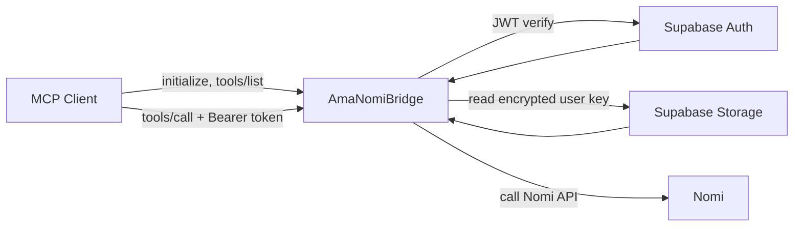

# AmaNomiBridge


A multi-tenant MCP gateway for the [Nomi API](https://api.nomi.ai/docs), designed for Vercel, Supabase authentication, ChatGPT Developer Mode, Claude MCP connector, and generic remote MCP clients.

> One bridge, many users: every user authenticates independently, stores their own Nomi key, and gets the same MCP tool surface.

---

## Architecture



## Why this repo exists

Remote MCP clients need a public HTTP endpoint, but Nomi credentials are user-specific. This project solves that by separating discovery from execution:

- MCP discovery stays public.
- Tool execution is protected by bearer auth.
- Every user stores their own Nomi API key.
- Nomi keys are encrypted before storage.

## Feature Snapshot

| Capability | What it does | Status |
|---|---|---|
| Public MCP discovery | `initialize`, `notifications/initialized`, `tools/list`, OAuth metadata | Ready |
| Protected MCP execution | `tools/call` requires bearer auth | Ready |
| User-scoped Nomi access | Every user operates with their own Nomi key | Ready |
| Encrypted credential storage | Keys are encrypted before being persisted | Ready |
| Onboarding UI | Login, key setup, connection status | Ready |
| Release automation | `dev` branch runs `test -> migrate -> deploy` | Ready |

## Available MCP Tools

| Tool | Description | Access |
|---|---|---|
| `list_nomis` | List Nomi characters for the authenticated user | Auth required |
| `get_nomi` | Fetch one Nomi by ID | Auth required |
| `send_message` | Send a direct message to a Nomi | Auth required |
| `list_rooms` | List rooms for the authenticated user | Auth required |
| `send_room_message` | Send a message to a room | Auth required |

Read-only tools expose `readOnlyHint` metadata for MCP clients that support it.

---

## Quick Start

### 1. Clone and install

```bash
git clone https://github.com/AmaLS367/AmaLinkNomi.git
cd AmaLinkNomi
npm install
```

### 2. Create `.env`

Use [.env.example](.env.example) as the template.

Required variables:

```env
NOMI_API_KEY=7f9c3f69-385f-4a22-afe7-d7b50852cd06
APP_BASE_URL=https://ama-link-nomi.vercel.app
SUPABASE_URL=https://your-project.supabase.co
SUPABASE_ANON_KEY=your-public-anon-key
SUPABASE_SERVICE_ROLE_KEY=your-service-role-key
SUPABASE_JWT_AUDIENCE=authenticated
```

Optional overrides:

```env
SUPABASE_JWT_ISSUER=https://your-project.supabase.co/auth/v1
SUPABASE_JWKS_URL=https://your-project.supabase.co/auth/v1/.well-known/jwks.json
NOMI_KEY_ENCRYPTION_KEY=any-secret-string
NOMI_API_BASE_URL=https://api.nomi.ai
```

If `NOMI_KEY_ENCRYPTION_KEY` is omitted, encrypted storage derives its key from `NOMI_API_KEY`.
If `APP_BASE_URL` is set, preview-host onboarding and consent requests are redirected back to that canonical origin, and browser auth redirects use it instead of the current host.

### 3. Apply the Supabase migration

Run the SQL from [20260329_create_user_nomi_credentials.sql](supabase/migrations/20260329_create_user_nomi_credentials.sql) in Supabase SQL Editor.

### 4. Configure Supabase Auth

- Enable at least one sign-in method.
- The UI supports Google OAuth and magic-link email login.
- Set the correct `Site URL` and `Redirect URLs`.

If this is misconfigured, auth redirects often bounce to `http://localhost:3000`.

### 5. Start locally

```bash
npm run dev
```

Useful local routes:

| Route | Purpose |
|---|---|
| `http://localhost:3000/` | Onboarding / dashboard |
| `http://localhost:3000/settings` | Nomi key management |
| `http://localhost:3000/status` | Technical connection status |
| `http://localhost:3000/api/mcp` | MCP endpoint |
| `http://localhost:3000/.well-known/oauth-protected-resource/api/mcp` | OAuth protected resource metadata |

---

## Authentication Model

The bridge uses a mixed MCP surface:

| Request type | Auth |
|---|---|
| `initialize` | Public |
| `notifications/initialized` | Public |
| `tools/list` | Public |
| OAuth metadata | Public |
| every `tools/call` | Bearer token required |

Protected requests expect:

```http
Authorization: Bearer <supabase-access-token>
```

If a client calls a protected MCP method without a valid token, the server responds with `401` and the appropriate `WWW-Authenticate` header.

## Onboarding Flow

1. Open `/`
2. Sign in with Google or a Supabase magic link
3. Open `/settings`
4. Save your personal Nomi API key
5. The bridge validates it against Nomi before storing it
6. The encrypted key is stored in `user_nomi_credentials`

The MCP tools themselves never accept or persist Nomi API keys directly.

---

## Deployment Model

This repo is configured for a single Vercel function entrypoint at `api/index.ts`.

### Branch strategy

| Branch | Role |
|---|---|
| `dev` | GitHub Actions release branch: test, migrate, deploy |
| `main` | Standard Vercel Git deployment branch |

### Workflow map

| Workflow | Triggers | Purpose |
|---|---|---|
| `CI` | `pull_request`, push to `main`, push to `dev` | Quality gates for branch protection |
| `Production Release` | push to `dev`, manual dispatch | Verify, migrate Supabase, deploy production |

### Recommended required checks

- `CI / verify`
- `CI / security`

### GitHub Actions release flow

The workflow [production-release.yml](.github/workflows/production-release.yml) currently auto-runs on `dev` and performs:

1. `npm test`
2. `npm run build`
3. `supabase db push`
4. `vercel deploy --prod`

### CI quality gates

The workflow `CI` currently enforces:

1. `npm test`
2. `npm run build`
3. `npm audit --omit=dev --audit-level=high`

The security gate is intentionally limited to production dependencies and does not yet include linting, CodeQL, or formatter checks.

Required GitHub secrets:

- `SUPABASE_ACCESS_TOKEN`
- `SUPABASE_PROJECT_REF`
- `SUPABASE_DB_PASSWORD`
- `VERCEL_TOKEN`
- `VERCEL_ORG_ID`
- `VERCEL_PROJECT_ID`

### Vercel prerequisites

Before production deploys:

1. Set the environment variables from `.env.example`
2. Apply the Supabase migration
3. Enable your Supabase sign-in method
4. Keep Vercel function duration at 60 seconds or higher

### Dependabot

Dependabot runs monthly for:

- `npm`
- GitHub Actions

Dependency update PRs target `main` and are intentionally rate-limited to keep review noise manageable.

### Issue intake

GitHub issue forms are available for:

- bug reports
- feature requests
- config/deploy issues

Blank issues are disabled so new reports arrive with enough structure to debug them quickly.

---

## Project Structure

```text
AmaLink Nomi/
├── api/
│   └── index.ts
├── src/
│   ├── adapters/vercel/
│   ├── app/
│   ├── auth/
│   ├── config/
│   ├── nomi/
│   ├── security/
│   ├── storage/
│   ├── supabase/
│   ├── tools/
│   └── ui/
├── supabase/
│   └── migrations/
├── test/
├── vercel.json
└── .github/workflows/
```

## Security Notes

- Raw Nomi keys are never logged.
- Raw bearer tokens are never logged.
- User data is derived from token subject, not MCP tool arguments.
- Nomi keys are stored encrypted at rest.

## Troubleshooting

### `500` on `/api/me/nomi-key/status` or `/api/me/nomi-key`

Most likely cause: the `user_nomi_credentials` table migration was not applied.

### Login redirects to `localhost:3000`

Your Supabase Auth URL configuration is pointing to the wrong site URL or missing the deployed callback origin.

### Login or consent bounces to an old Vercel preview URL

Set `APP_BASE_URL` to your production origin, for example `https://ama-link-nomi.vercel.app`, in both local env and Vercel project environment variables. The UI then redirects preview-host onboarding and consent pages back to the canonical domain and uses that canonical URL for Supabase email and Google redirects.

### Build succeeds but Vercel expects `public`

This repo uses a function-based Vercel deployment. The explicit `outputDirectory` in [vercel.json](vercel.json) prevents static-output confusion.

---

## Client Notes

- ChatGPT Developer Mode: use `https://<your-domain>/api/mcp`
- Claude MCP connector: same endpoint, same bearer auth model
- Generic remote MCP clients: same endpoint, same OAuth metadata
